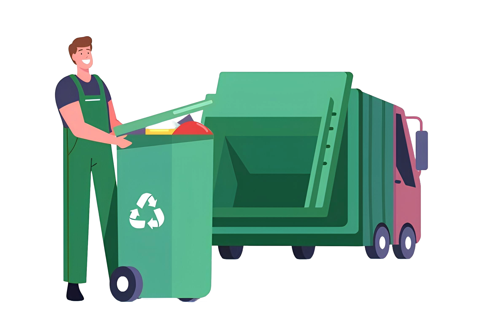
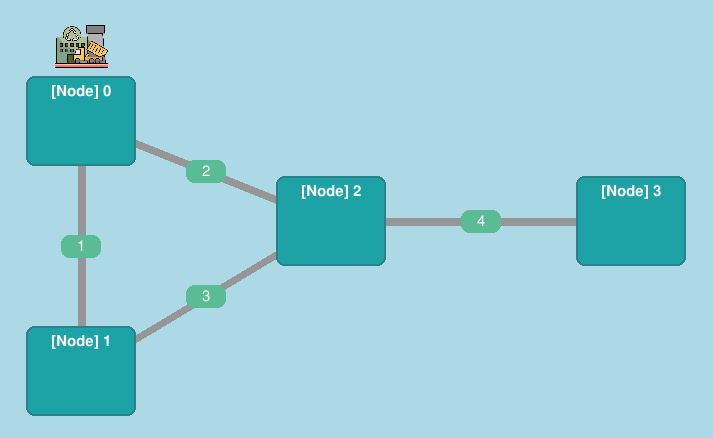
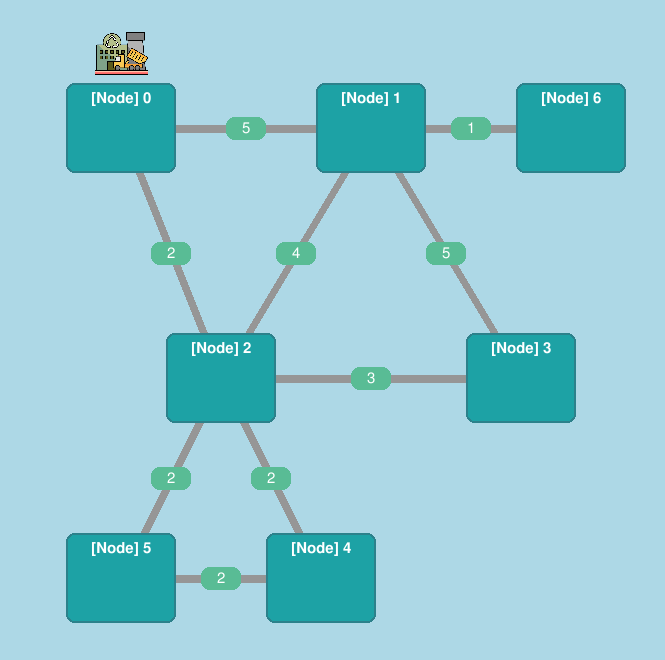
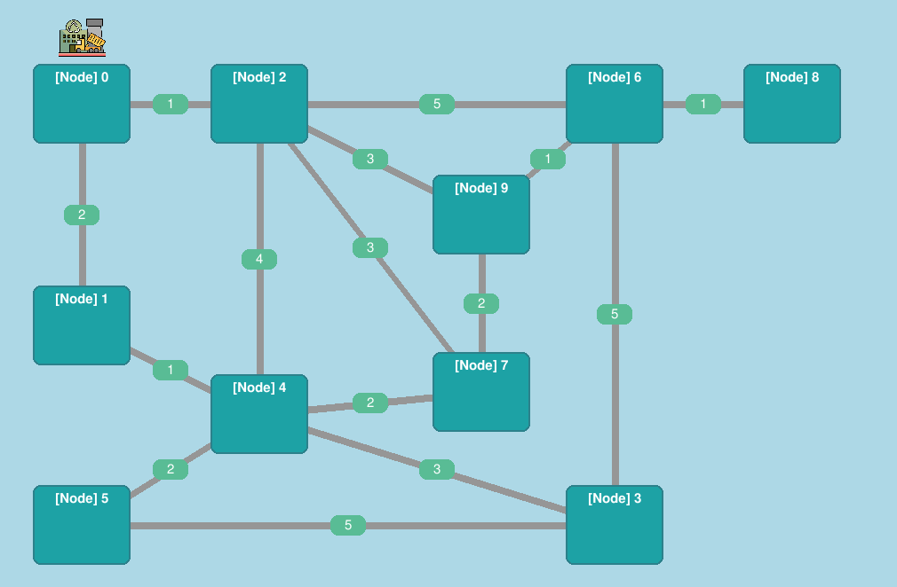

    <h1>Multi-Agent Autonomous Waste Collection System</h1>

    

    
    

 

    
    
    
    

## Project Overview

### Problem Scenario

In large **urban areas**, managing **waste collection** efficiently is a challenge, especially with varying levels of waste production and **changing road conditions** (e.g., traffic, roadblocks). Instead of a centrally controlled system, autonomous garbage trucks are deployed to handle waste collection, where each truck operates as an **independent agent**. These agents must work together to **optimize routes**, avoid redundant collections, and **manage limited resources** such as fuel or battery levels.

### Objective

Design and implement a **decentralized waste collection system** using Multi-Agent Systems (MAS) with **SPADE**. The system will **simulate autonomous garbage trucks** (agents) that collaborate to **efficiently collect waste from various locations** within a city, responding dynamically to changes in waste levels and traffic conditions.

### Key Features

1. `Truck Agents`: Each **truck** is represented by an agent responsible for **collecting waste** from assigned areas. These agents can **detect the fill levels of nearby waste bins** and **decide whether to collect** based on factors such as current waste capacity, fuel or battery level, and proximity to the bin.

2. `Bin Agents`: **Waste bins** are also represented by agents that **regularly report their fill levels** to nearby truck agents. When the fill level reaches a defined threshold, they **trigger a collection request to the closest truck agents**.

3. `Decentralized Decision-Making`: The system is fully **decentralized**, meaning each truck agent makes **independent decisions** about when to collect waste, where to go next, and how to optimize its route. **No central controller is required**. Agents **communicate with each other** to prevent overlapping collection areas and **ensure full city coverage**.

4. `Dynamic Environment`: The environment includes **dynamic factors** such as changing traffic conditions, roadblocks, and fluctuating waste production. Truck agents must **adjust their routes** in real-time based on these factors to ensure **efficient operation**.

5. `Task Allocation and Collaboration`: The system uses a **negotiation or task allocation protocol** (e.g., **Contract Net Protocol**) that allows truck agents to **share responsibilities and delegate tasks** to nearby agents if they are overloaded. This ensures **efficient coverage** of all waste bins.

6. `Resource Management`: Each truck has **limited resources**, such as fuel/battery life and waste capacity. Truck agents need to plan their routes to **minimize fuel consumption while maximizing the amount of waste collected per trip**. When necessary, trucks return to a central depot to unload or recharge.

7. `Optimization Metrics`: The system tracks several **key performance metrics** to measure efficiency:

   - **Total waste collected**

   - **Average collection time per bin**

   - **Total fuel or battery consumption**

   - **Distance traveled by each truck agent**

   - **Efficiency of collaboration and task allocation**

8. `Fault Tolerance`: The system is built to **handle agent failures**, such as trucks going offline or breaking down. When this occurs, the remaining agents automatically **redistribute tasks** to ensure waste collection continues without interruption.

## Environment Setup

If you plan to test this project yourself, make sure to review the **Environment** details by checking the [SETUP.md](https://github.com/EstevesX10/Multi-Agent-Autonomous-Waste-Collection-System/blob/main/SETUP.md) file for more information.

## Project Results

To thoroughly assess how changes to the environment affect **key performance metrics**, we developed **three distinct layouts of varying complexity**, as this approach allowed us to fully visualize and quantify their **impact** across a range of scenarios.

### Layout-1

    <table width="70%" height="70%">
        <thead>
            <th>
                

                    Graphical User Interface
                

            </th>
        </thead>
        <tbody>
            <tr>
                <td>
                    

                        
                    

                </td>
            </tr>
        </tbody>
    </table>

|  **Parameter In Analysis**   | **Baseline** | **Increased Number of Trucks** | **Increased Number of Bins** |
| :--------------------------: | :----------: | :----------------------------: | :--------------------------: |
|       Trash Generated        |     250      |              254               |             509              |
|       Trash Collected        |     289      |              303               |             619              |
|       Trash Deposited        |     247      |              232               |             484              |
|       Trash Overspill        |      0       |               0                |              5               |
|        Fuel Consumed         |      35      |               26               |             120              |
| Avg Truck Distance Travelled |     9.86     |              7.6               |             40.0             |
|   Avg Bin Collection Time    |    11.11     |              8.41              |            34.71             |

### Layout-2

    <table width="50%" height="50%">
        <thead>
            <th>
                

                    Graphical User Interface
                

            </th>
        </thead>
        <tbody>
            <tr>
                <td>
                    

                        
                    

                </td>
            </tr>
        </tbody>
    </table>

|  **Parameter In Analysis**   | **Baseline** | **Increased Number of Trucks** | **Increased Number of Bins** |
| :--------------------------: | :----------: | :----------------------------: | :--------------------------: |
|       Trash Generated        |     386      |              386               |             842              |
|       Trash Collected        |     475      |              572               |             856              |
|       Trash Deposited        |     287      |               92               |             724              |
|       Trash Overspill        |      0       |               0                |              11              |
|        Fuel Consumed         |     267      |               66               |             321              |
| Avg Truck Distance Travelled |    34.00     |             12.28              |             46.8             |
|   Avg Bin Collection Time    |    21.22     |             20.14              |            24.98             |

### Layout-3

    <table width="70%" height="70%">
        <thead>
            <th>
                

                    Graphical User Interface
                

            </th>
        </thead>
        <tbody>
            <tr>
                <td>
                    

                        
                    

                </td>
            </tr>
        </tbody>
    </table>

|  **Parameter In Analysis**   | **Baseline** | **Increased Number of Trucks** | **Increased Number of Bins** |
| :--------------------------: | :----------: | :----------------------------: | :--------------------------: |
|       Trash Generated        |     606      |              646               |             1292             |
|       Trash Collected        |     701      |              849               |             1412             |
|       Trash Deposited        |     486      |              466               |             1124             |
|       Trash Overspill        |      21      |               0                |              3               |
|        Fuel Consumed         |     386      |               99               |             602              |
| Avg Truck Distance Travelled |    29.73     |              7.27              |            47.67             |
|   Avg Bin Collection Time    |    16.71     |             12.64              |            18.49             |

## Conclusion

Our **decentralized approach** ensures **independent** behavior among truck agents working toward the common goal of trash collection. However, this can lead to **suboptimal routing** — trucks may prioritize nearby tasks over global efficiency, resulting in **increased fuel consumption**, **longer completion times**, **overlapping paths**, and **inefficient travel distances**.

## Authorship

- **Authors** &#8594; [Gonçalo Esteves](https://github.com/EstevesX10), [Nuno Gomes](https://github.com/NightF0x26) and [Pedro Afonseca](https://github.com/PsuperX)
- **Course** &#8594; Introduction to Intelligent Autonomous Systems [[CC3042](https://sigarra.up.pt/fcup/en/ucurr_geral.ficha_uc_view?pv_ocorrencia_id=546531)]
- **University** &#8594; Faculty of Sciences, University of Porto

<!--  -->

`README.md by Gonçalo Esteves`

